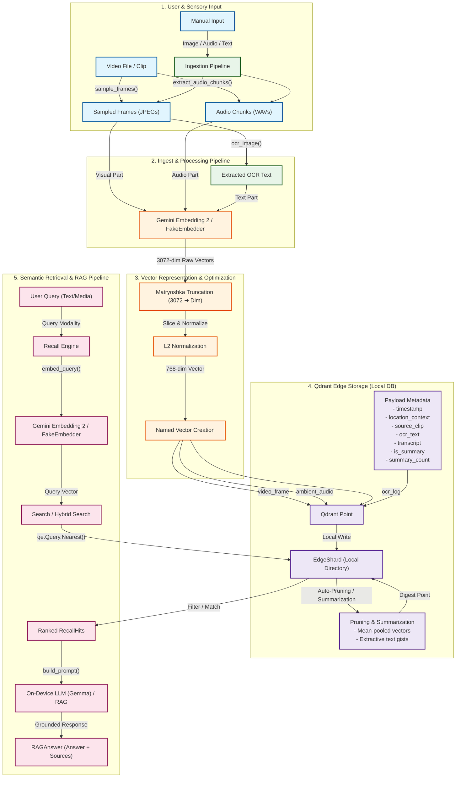
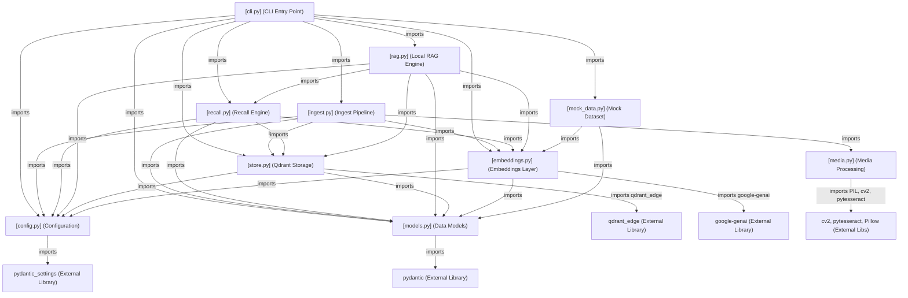
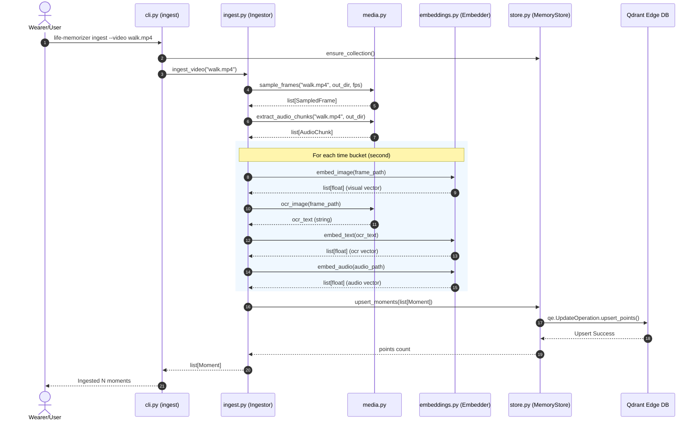
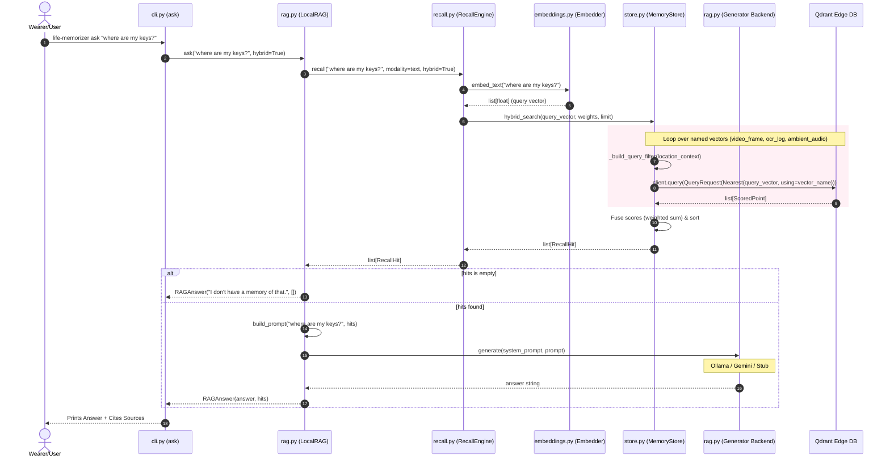

# Life Memorizer System Architecture & Codebase Documentation

This document provides a comprehensive technical analysis of the **Life Memorizer** system. It is generated directly from the actual Python codebase structure, imports, dependencies, data flows, and configuration rules.

---

## 1. System Architecture

Life Memorizer is an offline-first, multi-modal cognitive assistant that processes, embeds, indexes, and retrieves visual, auditory, and textual sensory data. It operates fully on the edge using a unified semantic embedding space and a lightweight, embedded vector database.

### Visual Architecture Diagram



### Architectural Explanation

#### 1. Ingestion Pipeline
Sensory input comes either from real files (such as a 5-minute video clip) or manual mocks. The [Ingestor](file:///c:/Users/Home/Desktop/life-memorizer/life_memorizer/ingest.py) splits the media into manageable chunks:
*   **Vision**: Sampled at a configurable frame rate (default 1.0 FPS) into JPEGs using [sample_frames()](file:///c:/Users/Home/Desktop/life-memorizer/life_memorizer/media.py#L32).
*   **Audio**: Extracted into fixed-length WAV chunks (default 5.0 seconds) via ffmpeg using [extract_audio_chunks()](file:///c:/Users/Home/Desktop/life-memorizer/life_memorizer/media.py#L74).
*   **OCR Text**: Extracted from vision frames via PyTesseract using [ocr_image()](file:///c:/Users/Home/Desktop/life-memorizer/life_memorizer/media.py#L114).

These items are grouped into time-aligned buckets (by second) representing discrete `Moment` objects.

#### 2. Embedding Layer
Life Memorizer maps visual, audio, and text modalities into a **single, unified semantic space** using `gemini-embedding-2` (or a lexical feature-hashing [FakeEmbedder](file:///c:/Users/Home/Desktop/life-memorizer/life_memorizer/embeddings.py#L120) for testing). 
*   **Matryoshka Truncation**: Native Gemini Embeddings are generated at 3072 dimensions. To save space and resources on edge devices, the first $N$ components (default 768) are sliced out using [matryoshka_truncate()](file:///c:/Users/Home/Desktop/life-memorizer/life_memorizer/embeddings.py#L31).
*   **Normalization**: The truncated vector is normalized under $L2$ norm to make it suitable for cosine similarity searches.

#### 3. Vector Database Storage
Points are stored in a local, embedded [qdrant-edge-py](file:///c:/Users/Home/Desktop/life-memorizer/life_memorizer/store.py) database ([EdgeShard](file:///c:/Users/Home/Desktop/life-memorizer/life_memorizer/store.py#L41)), bypassing server containers. Each `Moment` corresponds to one Qdrant point containing **Named Vectors**:
*   `video_frame` (Visual embedding of the sampled frame)
*   `ambient_audio` (Acoustic embedding of the audio segment)
*   `ocr_log` (Semantic text embedding of the OCR output or text notes)

Payload metadata includes `timestamp`, `timestamp_epoch`, `location_context`, `media_file_path`, `source_clip`, `transcript`, and `ocr_text`.

#### 4. Retrieval & Local RAG
*   **Single-modality search**: Matches a query vector against one specific named vector (e.g., matching a text query against the `video_frame` index for "where are my keys?").
*   **Hybrid search**: Searches multiple vector spaces with the same query vector, combining scores via a weighted sum (default: `video_frame` = 1.0, `ocr_log` = 1.0, `ambient_audio` = 0.6) inside [hybrid_search()](file:///c:/Users/Home/Desktop/life-memorizer/life_memorizer/store.py#L183).
*   **Local RAG**: Top retrieved `RecallHit` context blocks are formatted as grounded prompts. These are sent to an on-device LLM (Gemma via Ollama / Gemini API / deterministic mock) to output a conversational answer.

#### 5. Memory Lifecycle & Maintenance
Storage remains constant through aging policies:
*   **Pruning**: Expired points older than configured TTL (default 90 days) are deleted.
*   **Summarization**: Before deletion, expired moments are grouped by location context. Their named vectors are mean-pooled and re-normalized, and their textual logs are extractively summarized into a single searchable "digest" point, preserving a searchable memory footprint.

---

## 2. Codebase Knowledge Graph

This graph models the relationships between files, external libraries, data structures, and function calls.

### Dependency Graph (Imports)



### Runtime Execution Flow: Ingestion Pipeline

When a user runs the `ingest` command, video files are decomposed and stored as named vectors:



### Runtime Execution Flow: Query & Local RAG Pipeline

When a user asks a question, the query moves through retrieval and language model generation:



### Trace of a Query Moving through the System
1.  **Entry Point**: The user initiates a query via [cli.py](file:///c:/Users/Home/Desktop/life-memorizer/life_memorizer/cli.py#L129) (`life-memorizer ask`) or through Python APIs.
2.  **RAG Inception**: [LocalRAG.ask()](file:///c:/Users/Home/Desktop/life-memorizer/life_memorizer/rag.py#L181) calls [RecallEngine.recall()](file:///c:/Users/Home/Desktop/life-memorizer/life_memorizer/recall.py#L41) with `hybrid=True`.
3.  **Embedding Generation**: The query text is converted to a vector embedding using [Embedder.embed_text()](file:///c:/Users/Home/Desktop/life-memorizer/life_memorizer/embeddings.py#L50). Under real Gemini execution, this calls `models.embed_content()` with `gemini-embedding-2` to get a 3072-dimensional vector, which is Matryoshka-truncated to 768 dimensions and L2-normalized.
4.  **Vector Store Lookup**: The query vector is passed to [MemoryStore.hybrid_search()](file:///c:/Users/Home/Desktop/life-memorizer/life_memorizer/store.py#L183).
    *   The store runs three parallel/sequential queries against `video_frame`, `ocr_log`, and `ambient_audio` indices.
    *   Query requests include a filter constraint constructed by `_build_query_filter()` to apply location context restrictions (e.g., `location_context == "Cafe"`) and filter out mock vectors when real embeddings are enabled.
5.  **Score Fusion**: Qdrant returns scored points. The scores for the same `Moment.id` are summed using a weighted schema (e.g., multiplying visual scores by $1.0$, OCR by $1.0$, audio by $0.6$).
6.  **Grounded Prompt Generation**: The top $K$ ranked results (e.g., $5$) are formatted as a text block representing the wearer's memories. The user's question and this text block are combined into a prompt structured to restrict answers to the context only.
7.  **Answer Generation**: The prompt is processed by the configured `Generator` (Ollama/Gemma, Gemini API, or Stub), which extracts or synthesizes the answer.
8.  **Output Display**: The CLI prints the conversational answer and lists the source moments (cites timestamp, score, location context, and notes).

---

## 3. Repository Structure Documentation

The repository follows a clean, modular python structure optimized for edge execution:

```
life-memorizer/
├── .env.example                  # Template for environment variables
├── .gitignore                    # Git exclude patterns
├── CONTRIBUTING.md               # Contribution guidelines for developers
├── LICENSE                       # MIT License
├── README.md                     # Main documentation & quickstart guide
├── pyproject.toml                # Build system, metadata, and dependencies
├── requirements.txt              # Pinned requirements file
├── ARCHITECTURE-DOCUMENTATION.md # System architecture, codebase knowledge graph and architectural explanation of each code file
├── samples/                      # Sample video files (user-supplied or downloaded)
│   ├── pov-urban-bike-ride-through-city-streets.mp4
│   ├── vibrant-city-street-with-shops-and-pedestrians.mp4
├── life_memorizer/               # Core source package
│   ├── __init__.py               # Package initializer exporting modules
│   ├── cli.py                    # Command-line interface definitions
│   ├── config.py                 # Configuration settings loader & validator
│   ├── embeddings.py             # Multi-modal embedding (Gemini / Matryoshka)
│   ├── ingest.py                 # Ingestion pipeline coordinating media processing
│   ├── media.py                  # Media processing utils (OpenCV, ffmpeg, PyTesseract)
│   ├── mock_data.py              # Mock dataset for quick seeding and testing
│   ├── models.py                 # Core Pydantic data schemas & enums
│   ├── rag.py                    # Local Retrieval-Augmented Generation flows
│   ├── recall.py                 # Recall engine for vector & hybrid queries
│   └── store.py                  # Qdrant Edge vector store wrapper
└── tests/                        # Test suite directory
    ├── __init__.py               # Test package initializer
    ├── conftest.py               # Shared pytest fixtures (mock store / mock embedder)
    ├── test_embeddings.py        # Unit tests for real and fake embedding layers
    ├── test_rag.py               # Unit tests for LocalRAG pipeline
    ├── test_step5.py             # Unit tests for Step 5 (quantization & TTL pruning)
    └── test_store_and_recall.py  # Unit tests for Qdrant storage and retrieval
```

### Module Responsibilities & Dependencies

#### 1. [__init__.py](file:///c:/Users/Home/Desktop/life-memorizer/life_memorizer/__init__.py)
*   **Purpose**: Exposes the key classes and functions of the package, defining a clean Pythonic API interface.
*   **Responsibility**: Exports `Settings`, `Modality`, `Moment`, `RecallHit`, `GeminiEmbedder`, `FakeEmbedder`, `MemoryStore`, `Ingestor`, `RecallEngine`, `LocalRAG`, and `RAGAnswer`.
*   **Dependencies**: Internal modules (`config`, `models`, `embeddings`, `store`, `ingest`, `recall`, `rag`).

#### 2. [cli.py](file:///c:/Users/Home/Desktop/life-memorizer/life_memorizer/cli.py)
*   **Purpose**: Command line interface.
*   **Responsibility**: Defines and registers command endpoints (`init`, `ingest`, `recall`, `seed`, `ask`, `stats`, `prune`) using the `typer` library. Handles formatting and output display via the `rich` console.
*   **Dependencies**: `typer`, `rich`, and core package modules.
*   **Pipeline Role**: Serves as the primary CLI entry point for both ingestion (`ingest`, `seed`) and retrieval (`recall`, `ask`).

#### 3. [config.py](file:///c:/Users/Home/Desktop/life-memorizer/life_memorizer/config.py)
*   **Purpose**: Application configuration.
*   **Responsibility**: Parses and validates environment variables prefixed with `LIFE_MEMORIZER_` (using `pydantic-settings`). Exposes parameters for vector database sizing, quantization choices, embedding models, local RAG settings, and aging variables.
*   **Dependencies**: `pydantic`, `pydantic_settings`.
*   **Pipeline Role**: Provides runtime configurations to all components.

#### 4. [embeddings.py](file:///c:/Users/Home/Desktop/life-memorizer/life_memorizer/embeddings.py)
*   **Purpose**: Multi-modal embedding layer.
*   **Responsibility**: Interfaces with the `gemini-embedding-2` model via `google-genai` to generate aligned embeddings for text, images, and audio. Applies Matryoshka truncation and $L2$ normalization. Implements a lexical `FakeEmbedder` using feature hashing to support offline execution.
*   **Dependencies**: `google-genai`, `numpy`.
*   **Pipeline Role**: Core embedding component used during ingestion to vectorize sensory inputs and during retrieval to vectorize user queries.

#### 5. [ingest.py](file:///c:/Users/Home/Desktop/life-memorizer/life_memorizer/ingest.py)
*   **Purpose**: Ingest controller.
*   **Responsibility**: Integrates media utilities and embedding services to process video streams or manual uploads. It aligns inputs into structured moments and saves them to the storage layer.
*   **Dependencies**: `tempfile`, `datetime`, and internal modules (`config`, `embeddings`, `media`, `models`, `store`).
*   **Pipeline Role**: Coordinates the media preprocessing, embedding, and database insertion phases of the ingestion pipeline.

#### 6. [media.py](file:///c:/Users/Home/Desktop/life-memorizer/life_memorizer/media.py)
*   **Purpose**: Media processing utilities.
*   **Responsibility**: Samples frames from video files (via `opencv`), extracts audio tracks into wav slices (via `ffmpeg` command-line processes), and performs optical character recognition (OCR) on images (via `pytesseract`). It is designed to degrade gracefully if libraries are missing.
*   **Dependencies**: `cv2` (headless), `pytesseract`, `PIL`, `imageio_ffmpeg` (optional).
*   **Pipeline Role**: Handles raw media processing at the edge of the ingestion pipeline.

#### 7. [mock_data.py](file:///c:/Users/Home/Desktop/life-memorizer/life_memorizer/mock_data.py)
*   **Purpose**: Scripted sample dataset.
*   **Responsibility**: Provides a pre-written, coherent series of moments representing a wearer's afternoon. Contains text descriptions that simulate vision, speech, and OCR inputs.
*   **Dependencies**: `uuid`, `datetime`, and internal modules.
*   **Pipeline Role**: Seeds the database for testing or demonstration without requiring raw video files.

#### 8. [models.py](file:///c:/Users/Home/Desktop/life-memorizer/life_memorizer/models.py)
*   **Purpose**: Structured data schemas.
*   **Responsibility**: Defines shared, typed data representations for `Modality` (enum), `Moment` (base moment model), and `RecallHit` (search result container) using `pydantic`. Map modalities to Qdrant's named vectors.
*   **Dependencies**: `pydantic`, `uuid`, `datetime`.
*   **Pipeline Role**: The schema standard used throughout ingestion, vector indexing, retrieval, and RAG.

#### 9. [rag.py](file:///c:/Users/Home/Desktop/life-memorizer/life_memorizer/rag.py)
*   **Purpose**: Local Retrieval-Augmented Generation execution.
*   **Responsibility**: Orchestrates the retrieve-then-generate workflow. Connects with LLM backends (local Gemma via Ollama, Google GenAI API, or an offline deterministic extractor) to answer questions based on retrieved context.
*   **Dependencies**: `urllib`, `json`, `google-genai` (optional), and package modules.
*   **Pipeline Role**: The final output generator in the semantic recall pipeline.

#### 10. [recall.py](file:///c:/Users/Home/Desktop/life-memorizer/life_memorizer/recall.py)
*   **Purpose**: Semantic query controller.
*   **Responsibility**: Interfaces with the embedder to vectorize user inputs and runs them against the vector database. It supports single-modality target searches, audio searches, visual searches, and hybrid weighted-fusion searches.
*   **Dependencies**: `pathlib`, internal modules.
*   **Pipeline Role**: Orchestrates lookup routing during the retrieval process.

#### 11. [store.py](file:///c:/Users/Home/Desktop/life-memorizer/life_memorizer/store.py)
*   **Purpose**: Database storage layer.
*   **Responsibility**: Manages the local, file-backed `qdrant-edge-py` instance. Configures schemas, enables scalar/binary quantization configurations, performs keyword and integer payload indexing, writes batched point upserts, queries single/hybrid nearest-neighbors, and handles database maintenance (TTL pruning and mean-pooled moment summarization).
*   **Dependencies**: `qdrant-edge-py`, `numpy`, `time`, `datetime`.
*   **Pipeline Role**: The storage repository for both ingestion and retrieval.
